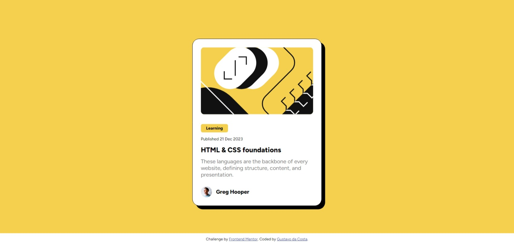
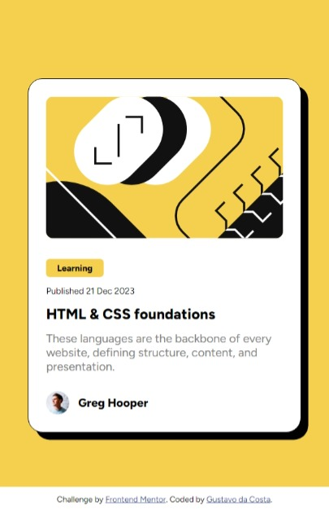

# Frontend Mentor - Blog preview card solution - English

This is a solution to the [Blog preview card challenge on Frontend Mentor](https://www.frontendmentor.io/challenges/blog-preview-card-ckPaj01IcS). Frontend Mentor challenges help you improve your coding skills by building realistic projects. 

## Table of contents

- [Overview](#overview)
  - [The challenge](#the-challenge)
  - [Screenshot](#screenshot)
  - [Links](#links)
- [Built with](#built-with)
- [Author](#author)

## Overview

### The challenge

Users should be able to:

- See hover and focus states for all interactive elements on the page

### Screenshot

### Links

- Solution URL: [Clik here](https://gugup4ulino.github.io/blog-preview-card/)

## Built with

- Semantic HTML5 markup
- CSS custom properties
- Flexbox
- Mobile-first workflow

## Author

- Frontend Mentor - [@GuguP4ulino](https://www.frontendmentor.io/profile/GuguP4ulino)
- Instagram - [@gustavoodacosta_](https://www.instagram.com/gustavoodacosta_)

# Frontend Mentor - Solução cartão de pré-visualização de blog - Português 

Esta é uma solução para o [desafio do cartão de pré-visualização de blog do Frontend Mentor](https://www.frontendmentor.io/challenges/blog-preview-card-ckPaj01IcS). Os desafios do Frontend Mentor ajudam você a melhorar suas habilidades de codificação através da construção de projetos realistas. 

## Índice

- [Visão geral](#visão-geral)
  - [O desafio](#o-desafio)
  - [Capturas de tela](#capturas-de-tela)
  - [Links](#links)
- [Construído com](#construído-com)
- [Autor](#autor)

## Visão geral

### O desafio

Os usuários devem ser capazes de:

- Ver os estados de hover e focus para todos os elementos interativos da página.

### Capturas de tela

### Links

- URL da solução: [Clique aqui](https://gugup4ulino.github.io/blog-preview-card/)

## Construído com

- Marcação HTML5 semântica
- Propriedades personalizadas CSS
- Flexbox
- Fluxo de trabalho mobile-first

## Autor

- Frontend Mentor - [@GuguP4ulino](https://www.frontendmentor.io/profile/GuguP4ulino)
- Instagram - [@gustavoodacosta_](https://www.instagram.com/gustavoodacosta_)